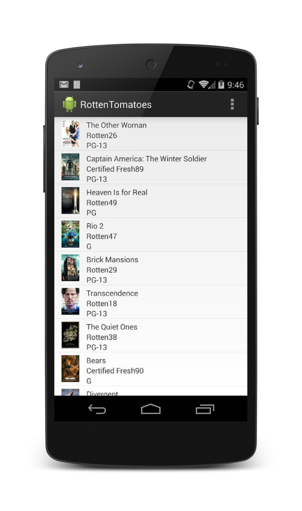

### Rotten Tomatoes

1. Written in two (2) hours as part of the GDG Cincinnati users group. 
2. The challenge can be found [here](https://plus.google.com/117137315626535078562/posts/7LTDBan8UiF)

Features Include: 

1. JSON Request/Parsing with Retrofit/Gson
2. Response caching using OkHttp
3. Asynch image loading and caching using Picasso

  

